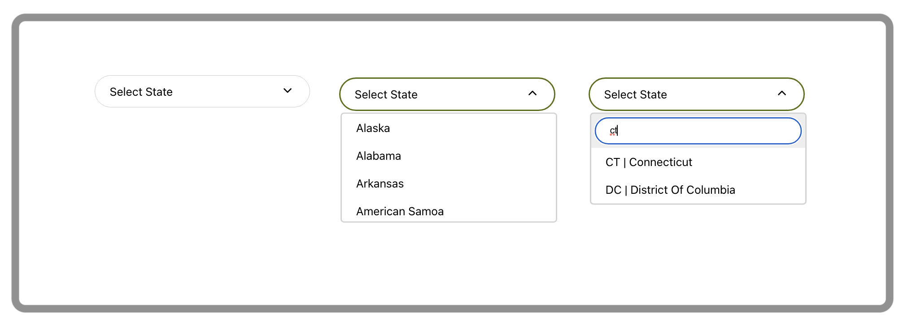

# React Searchable Dropdown Component

## About
This component will enable you to add a custom dropdown component to your React application. 

Amongst others, its key advantages include the ability to search your dropdown's options, use your own up/down arrows, and update the parent component's state with either dropdown's key or value. 

## Prerequisites
- [NodeJS](https://nodejs.org/en/).
- [npm](https://www.npmjs.com/).
- Naturally, you will need to be building a [React](https://reactjs.org/) application as the dropdown relies on a number of React imports.

## Installation 
Run `npm install react-searchable-dropdown-component`.

## Use
1. Import the dropdown like so `import {Dropdown} from 'react-searchable-dropdown-component';`
1. Use the dropdown as you would any other React component. The dropdown accepts the following parameters:

        <Dropdown   placeHolder='Select State'
                    options={stateList}
                    arrowDown={<ArrowDropDownOutlinedIcon/>}
                    arrowUp={<ArrowDropUpOutlinedIcon/>}
                    isSearchable
                    parentElementStateSetter={wrapperSetHomeState}
                    persistKey
        />
                             
1. You will find detailed description of each parameter below.

## Available APIs

### `placeHolder='string'`
`placeHolder` describes dropdown's purpose in its furled state. You can omit this parameter if you wish but then it will become difficult to understand its purpose.

### `options={array}`
`options` accept an array of json `"key":"value"` pairs:

        const usaStates = [
            {
                "key": "AL",
                "value": "Alabama"
            },
            {
                "key": "AZ",
                "value": "Arizona"
            }
        ];    
        
        <Dropdown   options={usaStates} />

**Note that the array must be in `"key":"value"` format.** If your array uses different names for its pairs, these should be renamed prior to passing them to the dropdown component.

### `arrowDown={<Component />}` and `arrowUp={<Component />}`
`arrowDown` and `arrowUp` serve to pass your own arrow icons to be displayed on the dropdown when it is furled and unfurled, respectively. These parameters are optional and in the absence of your icons default [Down SVG Vector](https://www.svgrepo.com/svg/430918/down) and [Up SVG Vector](https://www.svgrepo.com/svg/431354/up) will be used. 

        import ArrowDropDownOutlinedIcon from '@mui/icons-material/ArrowDropDownOutlined';
        import ArrowDropUpOutlinedIcon from '@mui/icons-material/ArrowDropUpOutlined';
        
        <Dropdown   arrowDown={<ArrowDropDownOutlinedIcon/>}
                    arrowUp={<ArrowDropUpOutlinedIcon/>}
        />

### `isSearchable`
`isSearchable` will enable your dropdown options to be search inside their `"key":"value"` pairs. A text input will appear just above all other options. This parameter is optional and can be omitted if not necessary.

### `parentElementStateSetter={wrapper}`
`parentElementStateSetter` will enable you to capture dropdown state change in its parent component. This could be useful if you use this dropdown in a form, for example, to keep the form's state in one place.

        const [homeState, setHomeState] = useState('');
        const wrapperSetHomeState = useCallback(value => {
                setHomeState(value);
        }, [setHomeState]);
        
        <Dropdown   options={usaStates}
                    parentElementStateSetter={wrapperSetHomeState} 
        />

### `persistKey`
By default, `parentElementStateSetter` will return `value` of the `"key":"value"` pair to its parent component. `persistKey` will enable you to pass `key` instead. 

## License
[ISC Open Source Software License](https://www.isc.org/licenses/)
