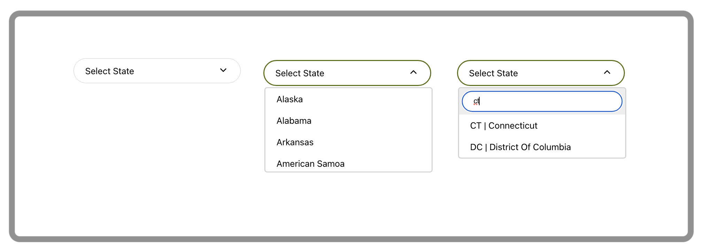

# React Searchable Dropdown Component

## About
This component will enable you to add a searchable dropdown selector to your React application. 

Amongst others, its key advantages include the ability to search your dropdown's options, use your own up/down arrows, and update the parent component's state with either dropdown's key or value. 

**Note:** If your React project was initiated with [Create React App](https://create-react-app.dev/), you are better off installing [react-app-searchable-dropdown-component](https://www.npmjs.com/package/react-app-searchable-dropdown-component) instead to avoid a possible Babel error.

## Prerequisites
- [NodeJS](https://nodejs.org/en/).
- [npm](https://www.npmjs.com/).
- Naturally, you will need to be building a [React](https://reactjs.org/) application as the dropdown relies on a number of React imports.

## Installation 
Run `npm install react-searchable-dropdown-component`.

## Use
1. Import the dropdown:

    `import {Dropdown} from 'react-searchable-dropdown-component';`
    
1. Use the dropdown as you would any other React component. The dropdown accepts the following parameters:

        <Dropdown   placeHolder='Select State'
                    options={useStates}
                    arrowDown={<ArrowDropDownOutlinedIcon/>}
                    arrowUp={<ArrowDropUpOutlinedIcon/>}
                    isSearchable
                    parentElementStateSetter={wrapperSetHomeState}
                    persistKey
        />
                             
1. You will find detailed description of each parameter below.

## Available APIs

### `placeHolder='string'`
`placeHolder` appears on the dropdown's first load in its furled state as a cue to what this selector is about.

### `options={array}`
`options` accept an array of json `"key":"value"` pairs:

        const usaStates = [
            {
                "key": "AL",
                "value": "Alabama"
            },
            {
                "key": "AZ",
                "value": "Arizona"
            }
        ];    
        
        <Dropdown   options={usaStates} />

**Note that the array must be in `"key":"value"` format.** If your array uses different names for its pairs, these should be renamed prior to passing them to the dropdown component.

### `arrowDown={<Component />}` and `arrowUp={<Component />}`
`arrowDown` and `arrowUp` serve to pass your own arrow icons to be displayed on the dropdown when it is furled and unfurled, respectively. These parameters are optional and in the absence of your icons default [Down SVG Vector](https://www.svgrepo.com/svg/430918/down) and [Up SVG Vector](https://www.svgrepo.com/svg/431354/up) will be used. 

        import ArrowDropDownOutlinedIcon from '@mui/icons-material/ArrowDropDownOutlined';
        import ArrowDropUpOutlinedIcon from '@mui/icons-material/ArrowDropUpOutlined';
        
        <Dropdown   arrowDown={<ArrowDropDownOutlinedIcon/>}
                    arrowUp={<ArrowDropUpOutlinedIcon/>}
        />

### `isSearchable`
`isSearchable` will enable your dropdown options to be searched inside their `"key":"value"` pairs. A text input will appear just above all other options. This parameter is optional.

### `parentElementStateSetter={wrapper}`
`parentElementStateSetter` enables you to capture dropdown state change in its parent component. This is especially useful when you use this dropdown in a form, for example, to keep the form's state in one place.

        const [homeState, setHomeState] = useState('');
        const wrapperSetHomeState = useCallback(value => {
                setHomeState(value);
        }, [setHomeState]);
        
        <Dropdown   options={usaStates}
                    parentElementStateSetter={wrapperSetHomeState} 
        />

### `persistKey`
By default, `parentElementStateSetter` will return `value` of the `"key":"value"` pair to its parent component. `persistKey` will enable you to pass `key` instead. 

## Troubleshooting

If your React project was initiated with [Create React App](https://create-react-app.dev/), you may be faced with a Babel error such as `Support for the experimental syntax 'jsx' isn't currently enabled`. This happens because Babel processes JS inside and outside of the app (i.e. its `src` directory) differently. If you encounter this error, rest assured that it is not a fault of the dropdown component itself.

There exists a precompiled version of this dropdown - [react-app-searchable-dropdown-component](https://www.npmjs.com/package/react-app-searchable-dropdown-component) - for projects kicked off with Create React App which does not produce this error. Simply alternate these components in your projects.

To remedy the error manually:
1. Create `babel.config.json` file in the root of your project and add the following block of code to it:

        {
          "presets": [
            "@babel/preset-env",
            [
              "@babel/preset-react",
              {
                "runtime": "automatic"
              }
            ]
          ]
        }

2. Locate `webpack.config.js` file in the `./node_modules/react-scripts/config/` directory. On line `474` (at the time of writing this document) change `configFile: false` to `configFile:true`. This will tell Babel to use the config file created in the step above.
3. Restart your app server to make sure configuration changes are applied. 

## License
[ISC Open Source Software License](https://www.isc.org/licenses/)
